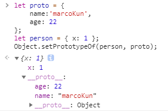

> Object.create()方法创建一个新对象，使用现有的对象来提供新创建的对象的__proto__。

### 语法
> Object.create(proto，[propertiesObject])

### 参数
>proto:新创建对象的原型对象

>propertiesObject:

可选。需要传入一个对象，该对象的属性类型参照Object.defineProperties()的第二个参数。如果该参数被指定且不为 undefined，该传入对象的自有可枚举属性(即其自身定义的属性，而不是其原型链上的枚举属性)将为新创建的对象添加指定的属性值和对应的属性描述符。

### 1.Object.create()和 new Object()有什么区别？


 - Object.create()可以理解为继承一个对象，添加的属性是在原型下，并且属性描述符皆为FALSE，比如writable，enumerable，configurable。
  - new Object()通过构造函数创建对象，添加的属性是在自身的实例下。
```javascript
let test = Object.create({}, { a: { value: 1 } })

test.p =2
console.log(test.p)//1,通过 Object.create()添加的属性是不可写,不可枚举,不可配置的
```

- 使用new Object()创建空对象，对象是有原型属性的（__proto_）而通过Object.create(null)创建空对象，是没有原型属性的。

### Object.create()添加的属性在原型下，如果不用它我们如何给一个对象的原型添加属性方法？

1.通过构造函数(存在副作用，如果函数有副作用比如改写状态，或者说给this添加属性)
```javascript
let Person = function(){}
Person.prototype.a = 1
let p = new People();
console.log(p.__proto__ === People.prototype) //true
```
2.**Object.setPrototypeOf** (它是 ES6 正式推荐的设置原型对象的方法。)
```javascript
let proto = {
    name:'marcoKun',
    age: 22
};
let person = { x: 1 };
Object.setPrototypeOf(person, proto);
```


### 通过Object.create()实现寄生组合式继承（相比于Object.setPrototypeOf仅仅多了一点性能损失，因为Child.prototype=Object.create(Father)，抛弃Child.prototype需要进行垃圾回收）
```javascript
function Father() {
  this.x = 0;
  this.y = 0;
}
// 父类原型上的属性
Father.prototype.num = 2
function Child() {
  Father.call(this); //调用父构造函数
}
// Child.prototype = Father.prototype 
//这样做当修改Child原型对象时，Father的原型对象也会收到影响，因此一般采用（1）组合继承，（2）寄生组合式继承，(3)es6类继承
// (1)组合继承（重复调用了父函数）
Child.prototype = new Father()调用父构造函数
Child.prototype.constructor = Child 
let child = new Child()

//（2）寄生组合式继承(只需要调用一次父函数)

Child.prototype=Object.create(Father)
Child.prototype.constructor = Child 
let child = new Child()
console.log(child instanceof Child)//TRUE
console.log(child instanceof Father)//TRUE

//(3)es6类继承

// 定义父类
    class Parent{
        static proArr = [1,2,3] // 要多个子类实例共享部分数据可以使用 static
        constructor(){
            this.name = "parent";
            this.colors = ["red", "blue", "yellow"];
        }

        sayFather(){
            console.log("来自父类的呐喊")
        }
    }

    // 定义子类
    class Child extends Parent{ // 继承父类且扩展
        constructor(){
            super();
//子类必须在constructor方法中调用super方法，否则新建实例时会报错。这是因为子类没有自己的this对象，而是继承父类的this对象，然后对其进行加工，如果不调用super方法，子类就得不到this对象。
            this.type = "child"; // 扩展父类属性
        }
        sayChild() {
            console.log("来自子类的呐喊")
        }
    }
```

